| Project   | Author      | Version |
| :-------- | :---------- | :-----: |
| MVERS-CLI | Tadeo Piana |   V.1   |

---

[[_TOC_]]

---

# Description

Version manager tool.

### use cases

This `cli` can be used to:

-   manage files components versions.
-   generate a component dependency map

### Limitations:

-   only `react.js` `.tsx` components files are supported
-   even if the whole process works with references files it's recommended to proceed one component at time. Avoid to mix multiple components.

### Installation

in order, to use the tool you must install it

-   from the repository: `npm install mvers-cli -g`
-   or direct from the project sources `npm i -g`
-   or by the build script `npm run build`

### usage

-   to invoke the tool use the keyword <`mvr`> <`commandName`> [`parameters`]

# How it works

(more specifications will come after)

To get the most out of this tool you should follow the following common steps.

prerequisite: determine if you need a setting file, if so, generate it (one shoot) - make changes to it - save the file - forget it

make sure to pick-up the component name that you want to work on.

1. Build

    - this step will produce all needed dependency files.

2. Version.up

    - this step will plan a new version

3. Update

    - this step will finalize and create the folders and files so you can start to work on you new versions.

4. Commit all the files.

5. move to the modification `user story`

the steps above will produce the minimal boilerplate needed to get started with a new versioned file for your components.

### others usages

For the convenience, the tool provides others features like

-   downgrade versions / upgrade toward a newer version for the component.

-   produce a dependency map that you can navigate to discover the dependencies of your components.

-   cleanup functions.

# Composition

## quick commands ref

| Command name             |               Options               | Descriptions                                                                                                            |
| :----------------------- | :---------------------------------: | ----------------------------------------------------------------------------------------------------------------------- |
| [builder](#builder)      |                 -b                  | Creates the initial file: 'raw_files.json' and 'dependencies.json' file which contains all project interesting files.   |
| [deps](#deps)            |     -b   -c   -sw   -r     | Generate dependency `html` files in `relations` folders                                                                 |
| [v-up/v-down](#v-updown) |     -b   -c   -sw   -v     | Upgrades or downgrades the version. outputs `files_versions.json`                                                       |
| [update](#update)        | -b   -c   -sw   -o   -v | Will update all files to the provided version or the latest version planed in `files_versions.json` file.               |
| [current-v](#current-v)  |         -b   -c   -sw         | Gets the current file version                                                                                           |
| [clear-v](#clear-v)      |  -b   -c   -sw     -v   | Will clears the versioned files from the `requestedVersion` (-v) or the latest found in the `files_versions.json` file. |
| [clear](#clear)          |                 -b                  | Will clear the `mvers` working files and folders.                                                                       |
| [init-conf](#initconf)   |                 -b                  | Will generate a local settings file                                                                                     |

---

## [BUILDER](src/commands/buildRoot.ts)

This process will initiate the needed files for the others `features`. Therefore, it's mandatory to do it first.

It will invoke : [loopProjectFiles](src/features/builder/loopProjectFiles.ts). and [recurse](src/features/builder/recursFile.ts) through all project files

then it will invoke [dependency](src/features/dependenciesParser/dependenciesParser.ts) in order to build up the `dependencies.json` file.
it will contains all the component dependencies

-   if you want to skip any file or folders - use a custom settings [file](#init-conf)

## [DEPS](src/commands/buildDependencies.ts)

This feature will produce a [chart](src/features/getComponentDependencyChart/getComponentDependencyChart.ts) map that uses : `https://mermaid.js.org/` online cdn. The output are some `.html` format files within the `relations` folder.

Generally there is only the root component file with dependencies.

If you want to navigate toward others children components you must append `-r(recursively)` to the command.

:warning: Note: this step is not mandatory in order to produce versioned component files. Take it just as a visual component map helper.

## [V-UP/DOWN ](src/commands/versionSwitch.ts)

This features builds the version file `files_versions.json` if not exists.

Then prepare upgrade or downgrade versions. this will not apply the changes on the project files yet. it's just preparation phase.

it will first build up a `classic` representation of [dependencies](src/features/dependencyBuilder/getDependencies.ts) from the requested component

then it will [flatten](src/features/versionManager/flattenTree.ts) down the relations `parents <== [component] ==> children` in order to have a flat view that can be used in order to create files easily and avoid to recursively lookup after them in the following process.

the final step is to loop through this flattened map [up](src/features/versionManager/setVersionUp.ts) or [down](src/features/versionManager/setVersionDown.ts) in order to produce the files.

output: `files_versions.json`

## [UPDATE](src/commands/updateFiles.ts)

This command will [update](src/features/updateFile/generateVersion.ts) the physical files.

it will first gather the [component](src/features/db/getComponent.ts) and the [requested version](src/features/db/getVersionNumber.ts) `(-v parameter) `

then it will try to get the data of version from [`files_versions.json`](src/features/updateFile/getExistingVersion.ts) file

then it will [check](src/features/updateFile/checkIfExists.ts) if any files for the same version doesn't exists yet. (if it's the case the process will warn you)

if not then it will [produce](src/features/updateFile/generateVersion.ts) the physical files and folder

then, it will rebuild [produce](src/features/builder/loopProjectFiles.ts) the project files and dependencies in order to take all newest versioned files into account, and update their [dependencies](src/features/dependenciesParser/dependenciesUpdater.ts)

then finally it will update the [imports](src/features/dependenciesParser/importsUpdater.ts) references in the versioned files

## [CURRENT-V](src/commands/getCurrentVersion.ts)

Gets the current component version.

## [CLEAR-V](src/commands/clearVersion.ts)

Will clear the versioned files and their directories.

If any change is detected the process will ask for confirm (y or Y) deletion.

## [CLEAR](src/commands/clearFiles.ts)

This command will clears out the mvr files in the version folder.

## [INIT-CONF](src/commands/initLocalSettings.ts)

If you need to specify some excluded files or folders, you must initiate a custom local settings `.json` file that will provide the base collections like in: [settings](src/features/settings.ts).

Once done, you update the local provided settings and it will be loaded up and will replace de default tool values while using the tool.

---

# options:

### basePath

-   -b or -basePath [basePath]
    represents the working path, is optional. If it's omitted, the current project path will be taken.

### component NAME

-   -c or -component ' \<componentName\>'
    the name of the component. :warning: if your project has many similar components names you better should provide a path pattern ie: `core/components/myComponent/ComponentName.tsx`

### searchWhere (component)

-   -sw or -searchWhere [searchWhere]

    -   values can be:
        -   name: the strict names
        -   fullName.contains: all files path that contains the given string.
        -   fullName: strictly the full path.

### overwrite

-   -o or -overwrite
    will overwrite the generated file and replace with a new version.

### version

-   -v or -version
    specified / requested component version. If omitted, the latest version is taken

### recursively

-   -r or -recursively
    will loop each import of the root given component and extract it's related dependencies

---

# Uses Cases

1. initial state

    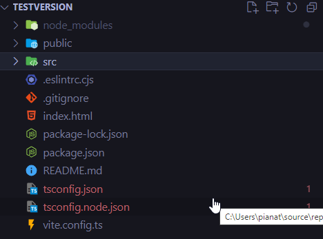

## create config file

-   open a terminal

    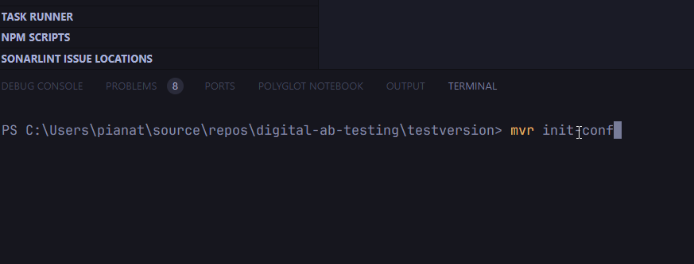

-   type: `mvr init-conf` then enter.

    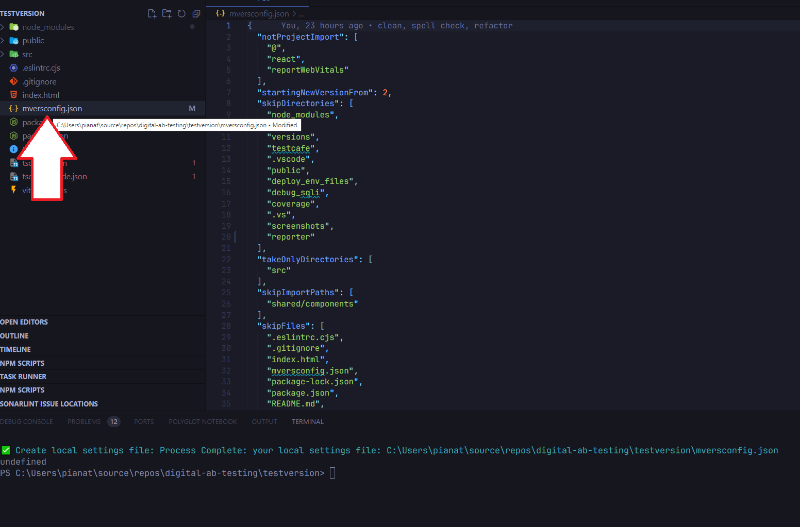

-   add extra configurations if needed

    -   for the example: let's pretend we do not want to include `shared` folder in our process

        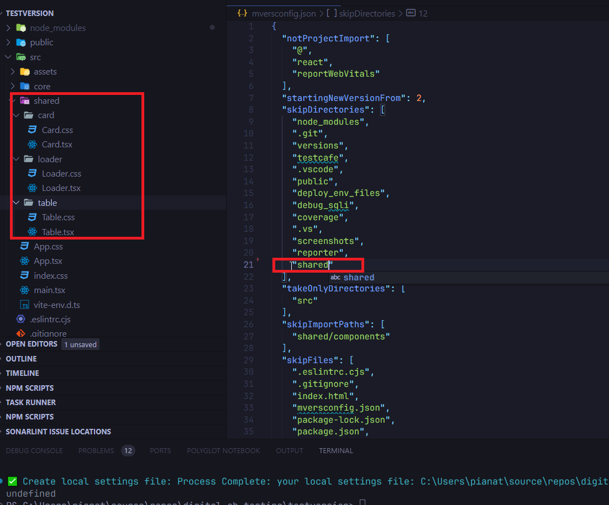

## build

-   open a terminal then type `mvr builder` then press enter

    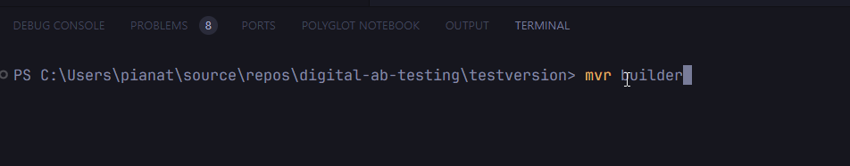

    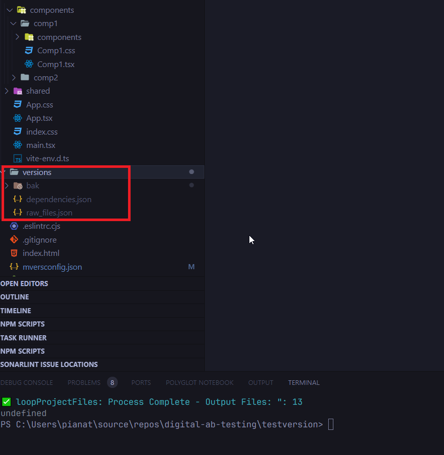

-   a new version folder was created with two files `dependencies.json` and `raw_files.json` the `bak` is not of our interest at the moment.
-   lets focus on our component candidate `Comp1.tsx`

    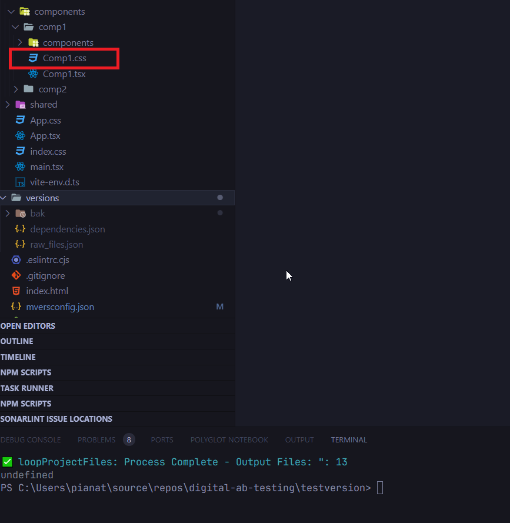

## v-up

-   we introduce a new command parameter `-c` for component name.
-   in the terminal type now: `mvr v-up -c core/components/comp1/Comp1.tsx` and append the name of the component then press enter

    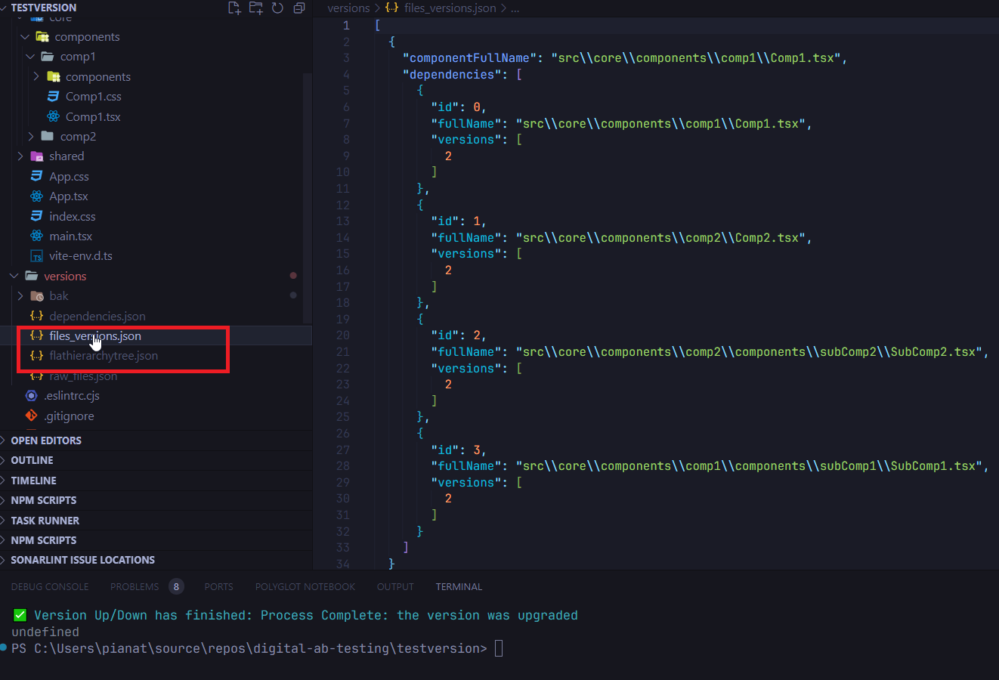

-   as you can see the process added two new files `files_versions.json` and `flathierarchytree.json`.
-   the most interesting for us to keep an eye on is `files_versions.json`. this one will track all the versions of the component.

    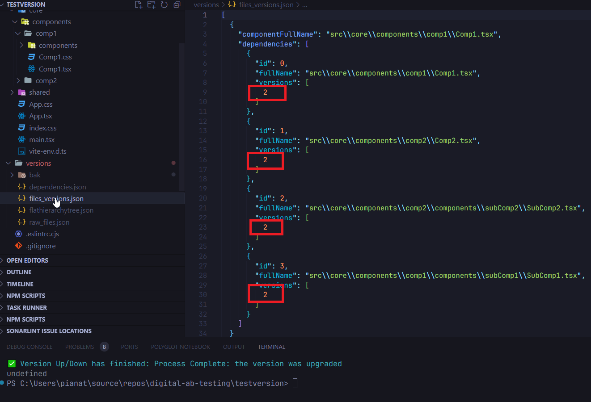

-   `flathierarchytree.json` is an internal process files it is not interesting in our process.

## update

-   until now we only prepare and plan new versions for our component and it's dependencies. (`files_versions.json`)
-   now we will apply changes and produce new version files.
-   open up the terminal and type `mvr update -c core/components/comp1/Comp1.tsx` then press enter

    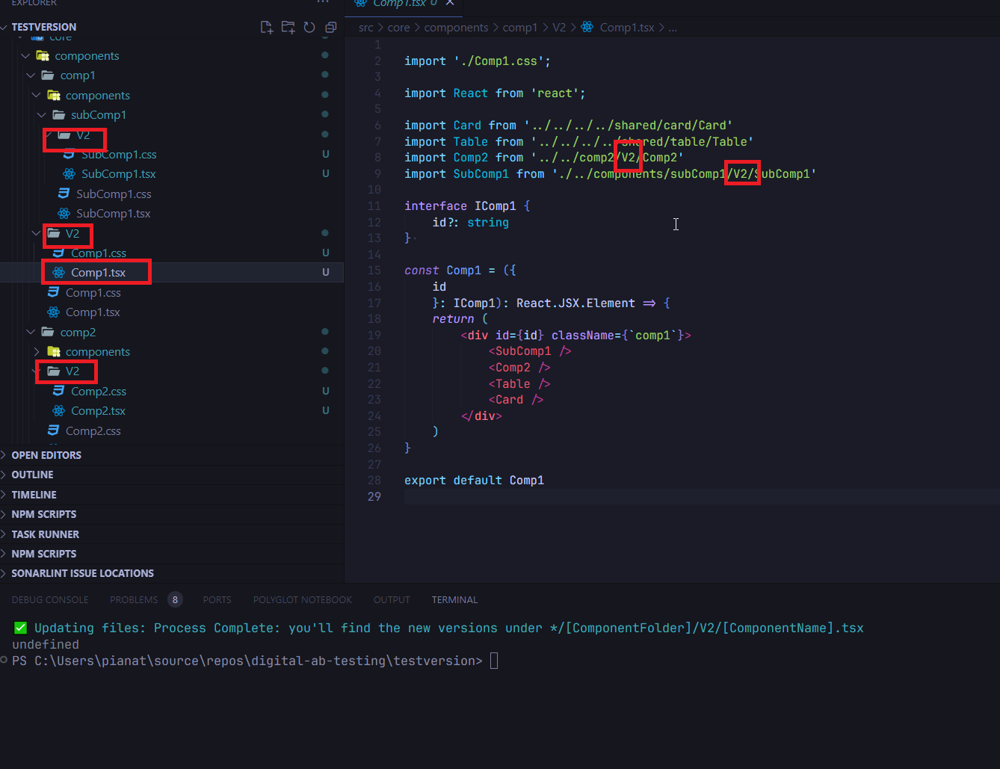

-   at this point we can notice that the process has created a copy of the component and dependencies and put them into the the `V#` folder.
-   `dependencies.json` and `raw_files.json` were updated
-   and the import were also updated

from this step, we can consider that our new component version is setup.

---

# CLEANUP

-   if for some reason you want to step back you can use a set of backward tools.
-   make sure to follow them the right way in order to let the process rollback correctly.

## clear-v

-   the first command you want to consider is the `clear-v`
-   open up the terminal and type `mvr clear-v -c core/components/comp1/Comp1.tsx`
-   this will remove versioned files. If you have any changes the process will ask you to confirm deletion.

    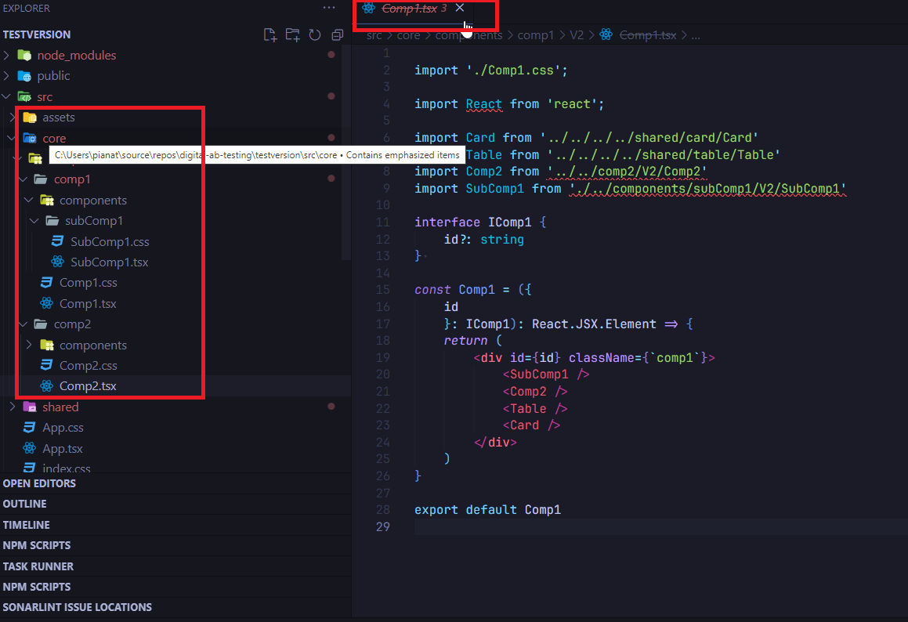

-   as you can notice: the versions files and folders were removed.

## clear

-   if you want to clear out the project from any `mvers` files then consider using `clear`
-   this command will wipe out all the files but the configuration. (this one you probably want to remove it by hand)

    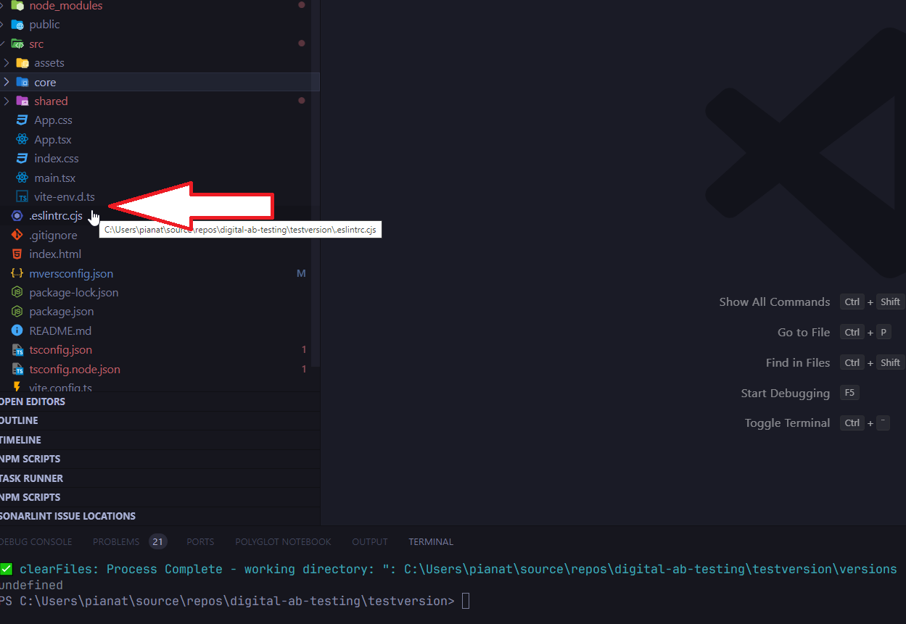

-   as you can notice all the `/versions/*` files were removed

## generate component map

-   if for some reason you need to produce a map of dependencies for any of the components of your app you may want to use the command DEPS

-   lets imagine that you wish to navigate from `App.txt` all the way down to your component `Comp1.tsx`

-   open up the terminal and type `mvr deps -c App.tsx -r` here we introduce a new parameter (-r) for recursive extract. Press enter.

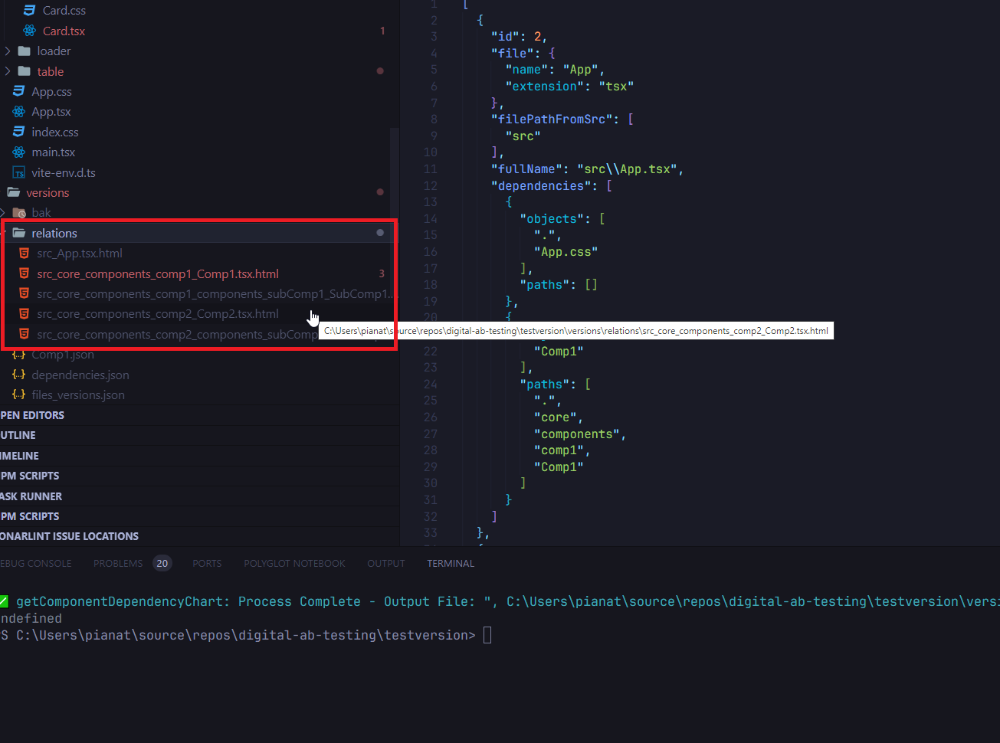

-   a new folder `relations` with `*.html` files were created.

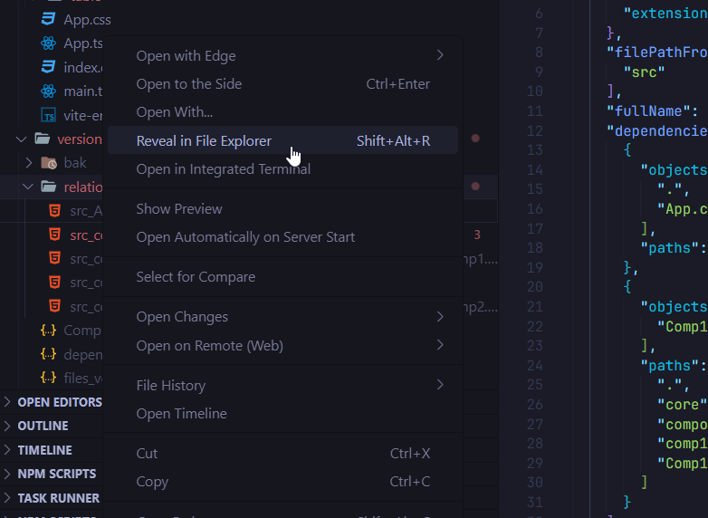

-   right click on the folder and hit `reveal in file explorer`

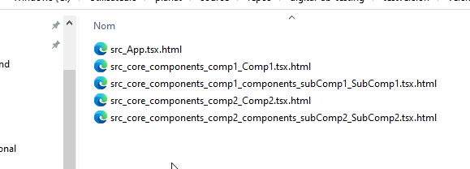

-   double click on `src_App.tsx.html`

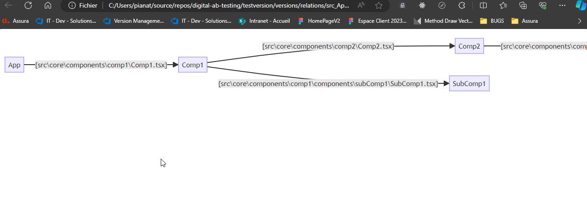

-   you can now navigate all dependencies of your component as long as they has been imported in the `raw_files.json` during the `BUILDER` process

-   at this point if you need to have more dependencies you can play with the settings file.

# KNOWN ISSUES

-   some terminal artifacts may remain during the process.

# FURTHER EVOLUTIONS

-   pass the scrips in asynchronous to be able to implement more interactivity.

# DEBUG AND DEV

1. open two vs code (or ide or your choice)

in the first load the `mvers-cli` project and run the script `npm run dev` it will build the project install the tool (-g) and start the watch mode to transpile the typescript => js

in the second load the project in which you want to execute the commands.
